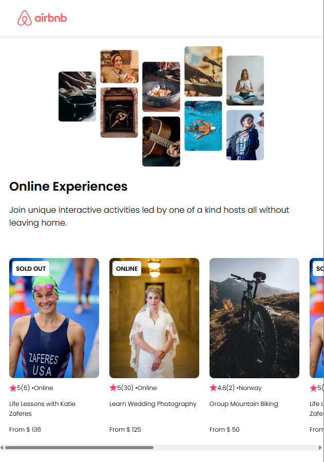

# Airbnb Experiences Clone with React

## Description

This project is a simplified clone of Airbnb Experiences, built using React. It allows users to explore and discover various experiences offered by hosts. Users can view details of each experience.

## Table of Contents

- [Installation](#installation)
- [Usage](#usage)
- [Features](#features)
- [Technologies Used](#technologies-used)

## Installation

1. Clone the repository:
   git clone [https://github.com/VanqCoding/REACT_airbnb-clone/tree/main.git](https://github.com/VanqCoding/REACT_airbnb-clone.git)

2. Navigate to the project directory:
   cd airbnb-experiences-clone

3. Install dependencies:
   npm install

## Usage

1. Start the development server:
   npm start

2. Open your browser and visit http://localhost:3000 to view the application.

## Features

- **Explore Experiences:** Browse and discover a variety of experiences offered by hosts.

## Technologies Used

- React
- Vite
- HTML/CSS/JavaScript

 
